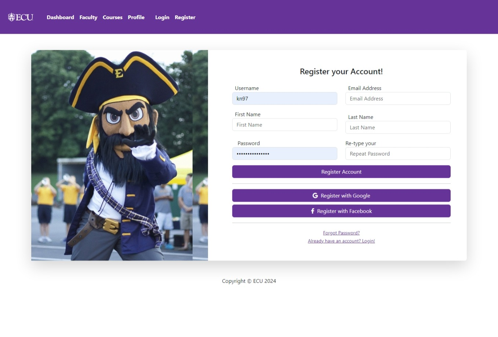

# 3010-proj-group-4

A starter project for undergrad students to gain familiarity with VMs and Web Development using "best" practices and methodologies. The goal of the project is to create an "Internal College Dashboard" that's used to display information about faculty, students, and courses.

---
.png "Faculty View")
.png "Course View")


---


## Prerequisites

Requisites needed to run the project include:
```bash
    python 3.12
```

## Cloning the Repository

To get started with the project, first clone the repository to your local machine.

```bash
git clone https://github.com/3010-Grp-4/3010-proj-group-4.git
cd 3010-proj-group-4
```

## Setting Up the Development Environment

### Creating a Virtual Environment

It's recommended to use a virtual environment for Python projects. This keeps dependencies required by different projects separate by creating isolated Python environments for them.

```bash
# Install virtualenv if you haven't installed it yet
pip install virtualenv

# Create a virtual environment
virtualenv venv

# Activate the virtual environment
# On Windows
.\venv\Scripts\activate
# On Unix or MacOS
source venv/bin/activate
```

### Change Directories

This repo's "main branch" was pre-created, therefore to create a Django-Project inside of the pre-created git repo. Changing directories into "Django Project" folder became a necessity.

```bash
# Change directories to Django project folder
# On Windows
dir ecu_dash
# On Unix or MacOS
cd ecu_dash
```

### Installing Dependencies

Install all dependencies required for the project.

```bash
pip install -r requirements.txt
```

## Configuring the Project

(Include steps specific to your project's configuration, such as setting up environment variables, database configurations, etc.)

## Running the Django Server

To run the Django development server:

```bash
python manage.py runserver
```

This will start the server on the default port `8000`. Access the web application by navigating to `http://127.0.0.1:8000/` in your web browser.

## Making Migrations

(If your project requires initial database setup, include instructions on making migrations and migrating the database.)

```bash
python manage.py makemigrations
python manage.py migrate
```

## Creating a Superuser

To access the admin panel, you'll need to create a superuser account.

```bash
python manage.py createsuperuser
```

Follow the prompts to create the superuser account.

## Exiting the Server

To stop the Django development server, press `Ctrl+C` in the terminal.

## Deactivating the Virtual Environment

When you're done working on the project, you can deactivate the virtual environment.

```bash
deactivate
```

---


## Using the Django Admin Site

The Django admin site offers a convenient web interface for managing your application's data. This guide walks you through accessing and using the admin site to perform Create, Read, Update, and Delete (CRUD) operations.

### Accessing the Admin Site

1. **Start Your Django Development Server** (if it's not running):
   - Navigate to your Django project directory in the terminal.
   - Activate your virtual environment.
   - Run the development server:
     ```bash
     python manage.py runserver
     ```

2. **Navigate to the Admin Site**:
   - Open your web browser.
   - Go to `http://127.0.0.1:8000/admin/` (adjust the port if your server uses a different one).

3. **Sign In**:
   - Use the superuser credentials you created earlier to log in.
   - If you haven't created a superuser yet, go back to your terminal, make sure you're in your project directory and your virtual environment is activated, then run:
     ```bash
     python manage.py createsuperuser
     ```
   - Follow the prompts to create your superuser account, then repeat steps 2-3.

### Performing CRUD Operations

Once logged in, you can manage your app's data using the Django admin interface. Here's how to perform basic CRUD operations:

#### Create (Adding New Records)

1. **Select the Model**: Click on the model name under the app section where you want to add a new record.
2. **Add New Record**: Click the "Add" button, fill out the form with your new data, and click the "Save" button at the bottom.

#### Read (Viewing Records)

- **View Records**: After selecting the model name, you'll see a list of existing records. Click on a record to view its details.

#### Update (Modifying Existing Records)

1. **Select a Record**: Click on the record you wish to modify from the list.
2. **Edit**: Change the data in the form as needed, then click the "Save" button.

#### Delete (Removing Records)

1. **Select and Edit a Record**: Follow the steps to update, but instead of modifying, scroll down and click the "Delete" button at the bottom of the form.
2. **Confirm Deletion**: You will be asked to confirm the deletion. Click the "Yes, I'm sure" button to permanently delete the record.

### Navigating the Admin Site

- **Dashboard**: The main page after you log in, showing all registered models.
- **Model Pages**: After clicking a model name, you see the list of records or an option to add new ones.
- **Individual Record**: Click on any record to view or edit its details.

### Logging Out

- **Sign Out**: Click your username in the top-right corner and select "Log out" from the dropdown menu.

---

 For more detailed tasks and customizations, refer to the [Django documentation](https://docs.djangoproject.com/en/stable/ref/contrib/admin/).

